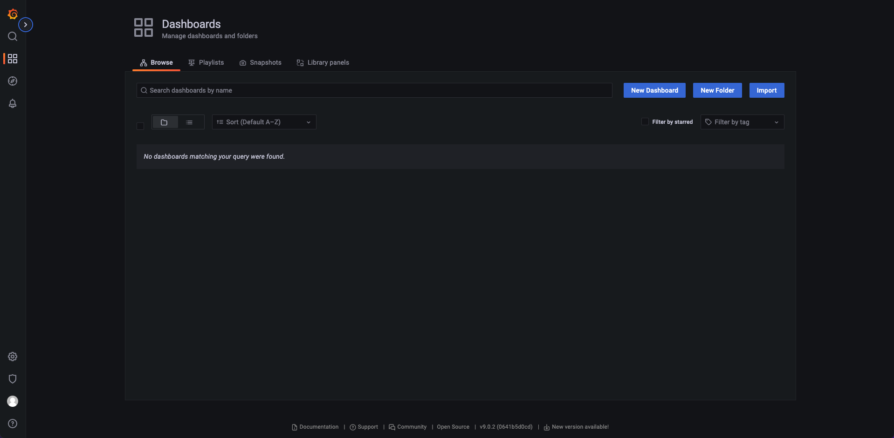
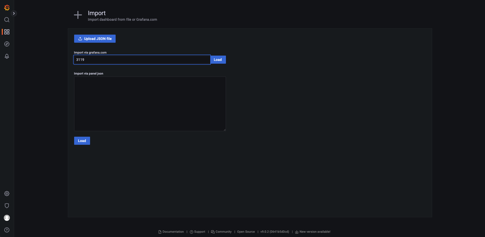
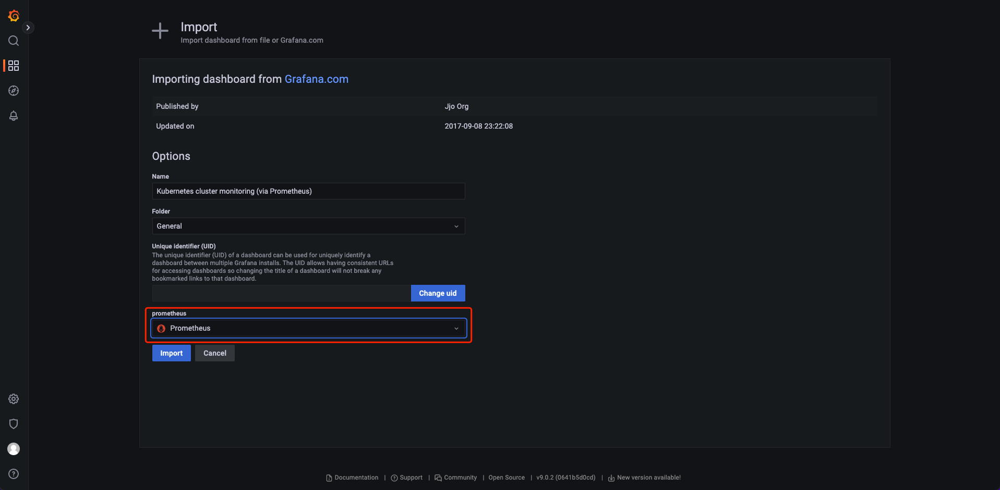
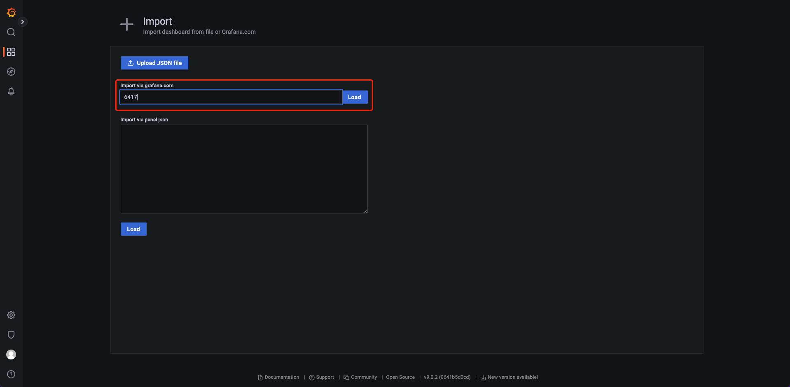
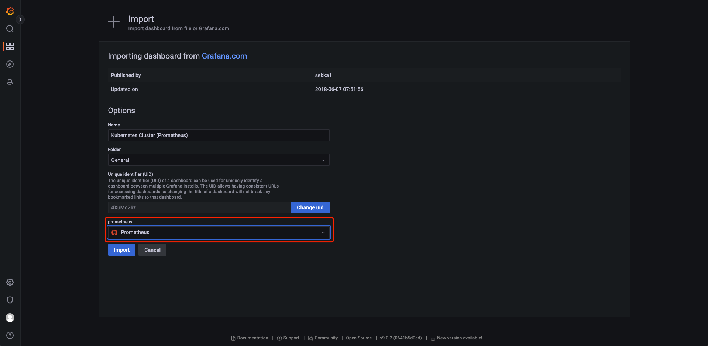
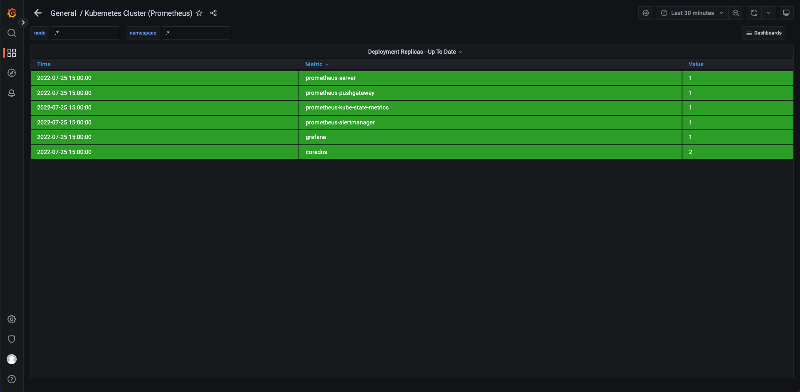

# Demo11-使用Prometheus和Grafana进行监控
--
#### Contributor: Yi Zheng
#### 更新时间: 2023-10-18
#### 基于EKS版本: EKS 1.27
--

## 1. 先决条件  
1.1 准备实验环境：参考Demo 01  
1.2 使用eksctl创建集群：参考Demo 02，不要执行 4. 镜像处置(针对中国区)  
1.3 已经安装helm  
1.4 设置环境变量
```
AWS_REGION=cn-northwest-1
AWS_DEFAULT_REGION=cn-northwest-1
CLUSTER_NAME=eksworkshop
ACCOUNT_ID=<>
```

## 2. 部署Prometheus
### 2.1 下载指定版本helm chart

```
helm repo add prometheus-community https://prometheus-community.github.io/helm-charts
helm pull prometheus-community/prometheus --version 15.10.4 # 如果下载失败，多试几次
tar -xzvf prometheus-15.10.4.tgz
```

### 2.2 修改kube-state-metrics镜像下载地址

```
cd ~/prometheus/charts/kube-state-metrics
sed -i 's@registry.k8s.io/kube-state-metrics/kube-state-metrics@bitnami/kube-state-metrics@' values.yaml
sed -i 's@v2.5.0@2.5.0@' values.yaml
```

### 2.3 安装prometheus chart

```
# 使用eksctl 创建service account
eksctl create iamserviceaccount \
    --name ebs-csi-controller-sa \
    --namespace kube-system \
    --cluster ${CLUSTER_NAME} \
    --role-name AmazonEKS_EBS_CSI_DriverRole \
    --role-only \
    --attach-policy-arn arn:aws:iam::aws:policy/service-role/AmazonEBSCSIDriverPolicy \
    --approve  \
    --region ${AWS_REGION}

# 添加Amazon EBS CSI driver add-on
eksctl create addon --name aws-ebs-csi-driver --cluster ${CLUSTER_NAME} --service-account-role-arn arn:aws-cn:iam::${ACCOUNT_ID}:role/AmazonEKS_EBS_CSI_DriverRole --region ${AWS_REGION} --force

# 创建storage class
cat <<EoF > ~/storageclass.yaml
apiVersion: storage.k8s.io/v1
kind: StorageClass
metadata:
  name: ebs-sc
provisioner: ebs.csi.aws.com
volumeBindingMode: WaitForFirstConsumer
parameters:
  type: gp3
EoF

kubectl create -f ~/storageclass.yaml

cd ~
kubectl create namespace prometheus
helm install prometheus ./prometheus --namespace prometheus --set alertmanager.persistentVolume.storageClass="gp2" --set server.persistentVolume.storageClass="gp2"

# 留意Prometheus endpoint，后续步骤会使用到  
The Prometheus server can be accessed via port 80 on the following DNS name from within your cluster:
prometheus-server.prometheus.svc.cluster.local

# 查看Prometheus组件是否部署成功  
kubectl get all -n prometheus
```

### 2.4 创建NodePort类型的Service，用于访问Prometheus

```
cat << EOF > ./prometheus-service.yml
apiVersion: v1
kind: Service
metadata:
  labels:
    app: prometheus
    chart: prometheus-15.10.4
    component: server
    heritage: Helm
    release: prometheus
  name: prometheus-nginx
  namespace: prometheus
spec:
  ports:
  - port: 9090
    protocol: TCP
    targetPort: 9090
  selector:
    app: prometheus
    component: server
    release: prometheus
  type: NodePort
EOF

kubectl apply -f prometheus-service.yml
```

### 2.5 获取prometheus server所在实例并放行安全组端口

```
nodeName=$(kubectl get pods -n prometheus -l component=server -o=jsonpath='{.items[0].spec.nodeName}')
nodePort=$(kubectl get svc prometheus-nginx -n prometheus -o=jsonpath='{.spec.ports[0].nodePort}')
groupId=$(aws ec2 describe-instances --filters "Name=private-dns-name, Values=$nodeName" --query "Reservations[0].Instances[0].SecurityGroups[0].GroupId" --output text)
aws ec2 authorize-security-group-ingress --group-id "$groupId" --protocol tcp --port $nodePort --cidr "0.0.0.0/0"
PublicDnsName=$(aws ec2 describe-instances --filters "Name=private-dns-name, Values=$nodeName" --query "Reservations[0].Instances[0].PublicDnsName"  --output text)

# 使用如下命令访问prometheus并查看数据
echo $PublicDnsName:$nodePort
```

## 3. 部署Grafana

### 3.1 下载指定版本helm chart

```
helm repo add grafana https://grafana.github.io/helm-charts
helm pull grafana/grafana --version 6.32.2
tar -xvzf grafana-6.32.2.tgz
```

### 3.2 安装grafana chart

```
kubectl create namespace grafana

helm install grafana ./grafana \
    --namespace grafana \
    --set persistence.storageClassName="gp2" \
    --set adminPassword='EKS!sAWSome' \
    --set datasources."datasources\.yaml".apiVersion=1 \
    --set datasources."datasources\.yaml".datasources[0].name=Prometheus \
    --set datasources."datasources\.yaml".datasources[0].type=prometheus \
    --set datasources."datasources\.yaml".datasources[0].url=http://prometheus-server.prometheus.svc.cluster.local \
    --set datasources."datasources\.yaml".datasources[0].access=proxy \
    --set datasources."datasources\.yaml".datasources[0].isDefault=true \
    --set service.type=NodePort
    
# 查看grafana是否创建成功
kubectl get all -n grafana
```

### 3.3 获取Grafana所在实例并放行安全组端口

```
nodePortGrafana=$(kubectl get --namespace grafana -o jsonpath="{.spec.ports[0].nodePort}" services grafana)
nodeNameGrafana=$(kubectl get pods -n grafana -l app.kubernetes.io/name=grafana -o=jsonpath='{.items[0].spec.nodeName}')
groupIdGrafana=$(aws ec2 describe-instances --filters "Name=private-dns-name, Values=$nodeNameGrafana" --query "Reservations[0].Instances[0].SecurityGroups[0].GroupId" --output text)
aws ec2 authorize-security-group-ingress --group-id "$groupIdGrafana" --protocol tcp --port $nodePortGrafana --cidr "0.0.0.0/0"
PublicDnsNameGrafana=$(aws ec2 describe-instances --filters "Name=private-dns-name, Values=$nodeNameGrafana" --query "Reservations[0].Instances[0].PublicDnsName"  --output text)

# 使用用户名admin和如下命令获取的password hash登陆
kubectl get secret --namespace grafana grafana -o jsonpath="{.data.admin-password}" | base64 --decode ; echo

# 使用如下命令访问grafana并查看数据
echo $PublicDnsNameGrafana:$nodePortGrafana
```

### 3.4 创建集群监控面板  
a.  左侧面板点击' + '，选择' Import '
  
b. Grafana.com Dashboard下输入3119  
 
c. prometheus data source下拉框中选择prometheus  
 
d. 点击' Import ' 
  

### 3.5 创建Pods监控面板  
a. 左侧面板点击' + '，选择' Import '  
b. Grafana.com Dashboard下输6417 
  
c. 输入Kubernetes Pods Monitoring作为Dashboard名称  
d. 点击change，设置uid  
e. prometheus data source下拉框中选择prometheus 
  
f. 点击' Import '  
  

## 4. 清理环境

```
aws ec2 revoke-security-group-ingress --group-id "$groupId" --protocol tcp --port $nodePort --cidr "0.0.0.0/0"
aws ec2 revoke-security-group-ingress --group-id "$groupIdGrafana" --protocol tcp --port $nodePortGrafana --cidr "0.0.0.0/0"

helm uninstall prometheus --namespace prometheus
helm uninstall grafana --namespace grafana
kubectl delete namespace prometheus
kubectl delete namespace grafana
```
